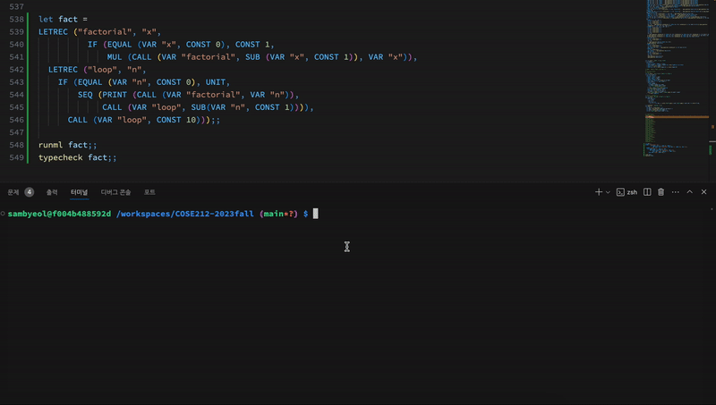

# COSE212_Programming_Language


## Preview
- Following ML- code represents recursive factorial function
```
LETREC ("factorial", "x",
        IF (EQUAL (VAR "x", CONST 0), CONST 1,
         MUL (CALL (VAR "factorial", SUB (VAR "x", CONST 1)), VAR "x")),
        LETREC ("loop", "n",
         IF (EQUAL (VAR "n", CONST 0), UNIT,
          SEQ (PRINT (CALL (VAR "factorial", VAR "n")),
           CALL (VAR "loop", SUB (VAR "n", CONST 1)))),
CALL (VAR "loop", CONST 10)))
```
- The interpreter and typechecker for ML- written by ocaml succesfully outputs a result and a type.


## Goal : Implementing Interpreter and Typechecker
- Design and implement a programming language called **ML-** with **ocaml**. 
- Specifically, implement **"Interpreter"** and **"Type Checker"** of ML- via ocaml.
- **ML-** is a small yet Turing complete functional language that supports built-in lists and (mutually) recursive procedures

## Full Language Specification
- Please refer to `Final_Project_Spec.pdf`.
